# water_logging_project
<br><br>
<br>

[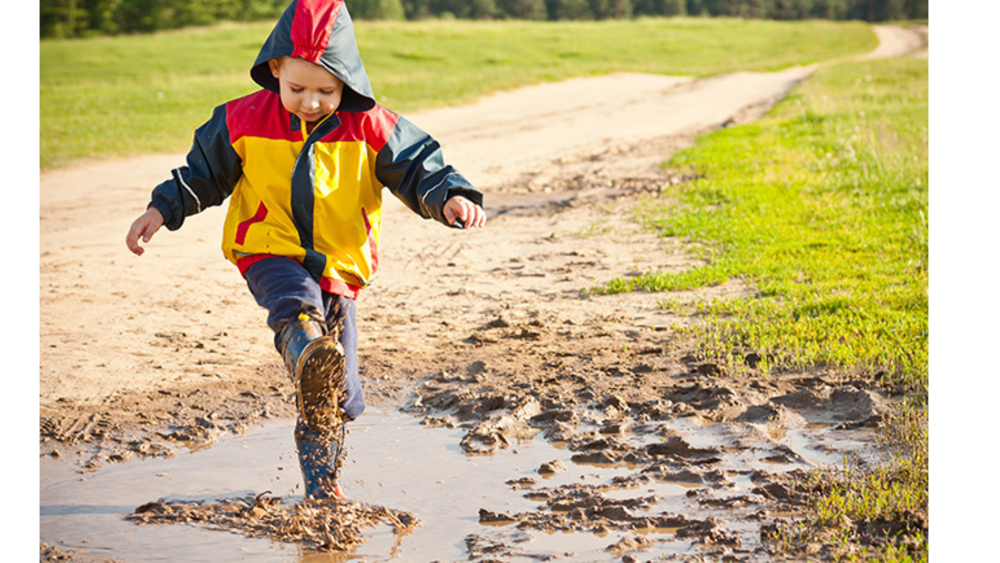](https://link-to-your-project)


# Abstract


The purpose of this project is to develop a model that can accurately identify water logging in school campuses using images. In a city with a high prevalence of Malaria, it has been observed that the problem is particularly affecting school students. Investigation by the government revealed that many schools are experiencing water logging issues within their premises. As a result, the school organizations have expressed the need for a system that can raise an alarm or notify the school administrators whenever water logging occurs.

To address this issue, we propose the development of a model that can analyze images captured by the cameras installed throughout school campuses. The model will employ computer vision techniques to detect and classify instances of water logging, allowing for timely intervention and resolution of the problem.

The successful implementation of this model will provide a valuable tool for schools to monitor and mitigate water logging issues, thereby creating a safer and healthier environment for students. Additionally, it will assist in the government's efforts to combat the spread of Malaria by addressing one of its root causes.

add a gif for website Demo
<br>
<br>
<br>

# Data Sources


Due to lack of prebuilt dataset I had to go through internet to search for public datasets related to water_logging around schools or any public places. but unfortunately I could not find what I was seeking for.

Now I had to find alternatives to datasets, for this I took two approaches

1.  **Finding related public datasets.**

    Although I couldn't find a specific dataset on water logging in schools, I managed to discover three relevant datasets during my search. These datasets focus on stagnant water on roads, European floods, and roadway flooding. While these datasets might not directly address water logging around schools, I extracted relevant information from each dataset to provide the model with a general understanding of stagnant or flooded water in public places.

    -   [Image Dataset for Roadway Flooding](https://data.mendeley.com/datasets/t395bwcvbw)
    -   [](https://github.com/cvjena/eu-flood-dataset)<https://github.com/cvjena/eu-flood-dataset>
    -   [Dataset of Stagnant Water and Wet Surface with Annotations](https://data.mendeley.com/datasets/y6zyrnxbfm/4)
  
  <br>
  <br>

2.  **Curating manually by going through hundreds of images manually.**

    For the major chunk of the Dataset I have used Google Images to curate the dataset. I have used following keywords.

    -   water logging in schools
    -   stagnant water in schools
    -   floods in schools
    -   water in school playgrounds
    -   water in roads
    -   water in indian village roads
    
    <br>

    For the negative or the other class I wanted images with similar background but without water logging. for that I used following keywords

    -   School premises
    -   school playground images
    -   kids playing in schools
    -   kind playing in playgrounds
    -   Empty school images
    -   Empty school playgrounds
    -   Indian village schools (Because for positive class I had enough of images with indian village schools)

    <br>

    For general context in negative class I wanted to have corresponding general context so I used following keywords

    -   Indian Village Roads
    -   Indian roads
    -   parking lots (because flood dataset had some images with water standing in places like parking lots)
    -   Indian Broken roads without water(just chose the one had no water in it)

    <br>

    Going through was a time consuming and tedious process took a major chunk of time for this

<br>
<br>

# Dataset Details


**Labelling** - I collated all of the images in to a folder and uploaded it to Roboflow and did the labeling manually going through individual images

**Preprocessing** - for preprocessing I have used the same Roboflow and used Auto Orient and Resize to 512 Images as images were of varied sizes.

**Distribution** - Initially the Dataset was distributed as following

<div style="display: flex; gap: 20px;">
  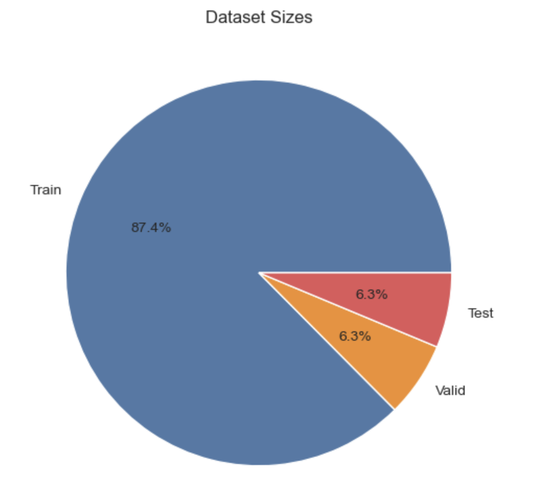
  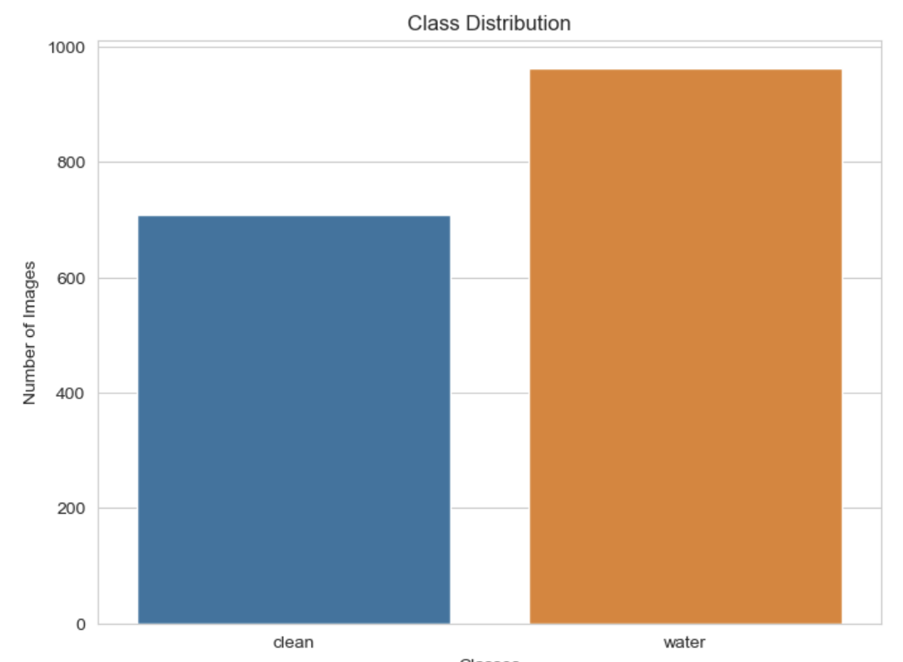
</div>

<br>

|    Dataset    | Count |
|--------------|-------|
|    Train    |  557  |
|   Valid    |  120  |
|    Test     |  120  |
|    Total     |  797  |


**Initial Augmentation** - for Initial Augmentation I had used following augmentation to increase the dataset capacity

- Flip - Horizontal

- Saturation - Between -25% and 25%

* Exposure - Between -20% and 20%

- Blur - upto 1 px

- CutOut - 2 boxes with 10% size

Using these on the training sets I was able to generate 3x of images.

<br>

**Final Distributions** After the Augmentation final distribution is

Train - 1671 Images 

|    Dataset    | Count |
|--------------|-------|
|    Train    |  1671  | (for each sample 1 image original and 2 from augmentations)
|   Valid    |  120  |
|    Test     |  120  |
|    Total     |  1911  |


Final Dataset Repository -
Have uploaded the dataset to my AWS s3 bucket as public link can be accessed with below link


[](https://datasetdumps.s3.ap-south-1.amazonaws.com/water_logging_dataset_v3.zip)<https://datasetdumps.s3.ap-south-1.amazonaws.com/water_logging_dataset_v3.zip>

<br>

# Evaluation Metrics


1.  F1 Score: It tells us how accurately the model can identify both positive and negative classes. A higher F1 score means the model is good at both precision and recall, making it an effective classifier.
2.  Precision-Recall Curve: It shows the trade-off between precision and recall, helping us find the best balance for our model's performance.
3.  ROC Curve: It also shows a trade-off, but between true positive rate and false positive rate. The area under the curve (AUC) summarizes the model's overall performance.
4.  Accuracy: It tells us the percentage of correctly classified instances overall. However, it may not be the best metric for imbalanced datasets.
5.  AUROC: It provides a single value summarizing the model's ability to distinguish between positive and negative classes, making it useful for comparing different models.
6.  Confusion Matrix: It's a table showing true positives, false positives, true negatives, and false negatives. It gives us a detailed breakdown of the model's performance and helps identify areas for improvement.

I chose AUC (Area Under the ROC Curve) and F1 Score as my main metrics to evaluate the models because they provide important insights into their performance.

AUC gives an overall measure of how well the model can distinguish between positive and negative classes. It condenses the model's performance into a single value, making it easy to compare different models and choose the best one.

F1 Score combines precision and recall into a single metric. It helps me understand how well the model performs in identifying both positive and negative instances, especially when dealing with imbalanced datasets. It provides a balanced evaluation, taking into account both precision (correctly identified positives) and recall (ability to find all positives).

By focusing on AUC and F1 Score, I can assess the models' overall effectiveness and their ability to handle imbalanced data. These metrics help me make informed decisions about the model's performance and choose the most suitable model for my project.

Usage
=====
```
# Cloning the Repo
cd water_logging_project_submission/


# Preparing the Dataset
wget https://datasetdumps.s3.ap-south-1.amazonaws.com/water_logging_dataset_v3.zip    
unzip water_logging_dataset_v3.zip
rm -rf water_logging_dataset_v3.zip


# Setting UP WandB key
os.environ["WANDB_API_KEY"] = WAND_KEY


#Running the Trainig
python main.py

```
# Experiment and Results

### [Model weights downloads](https://datasetdumps.s3.ap-south-1.amazonaws.com/models.zip)

<br>


## Experiment 1 - Details

|   Name   | BATCH_SIZE | NUM_EPOCHS |   LR   |   MODEL_PTH   |   AURoc    |  Accuracy  | F1_Score  |
|:--------:|:----------:|:----------:|:------:|:-------------:|:----------:|:----------:|:---------:|
| ResNet34 |     16     |     30     | 0.001  | resnet34.pth  | 0.976236999| 0.910714269| 0.921875  |

<br>

<div style="display: flex; gap: 20px;">
  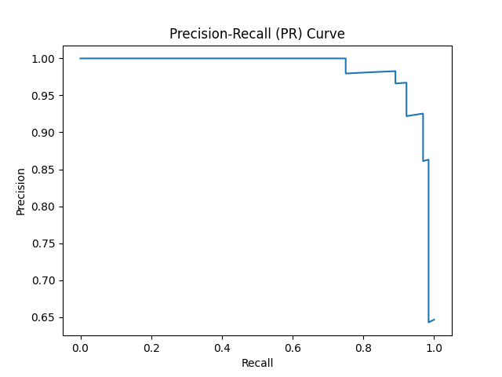
  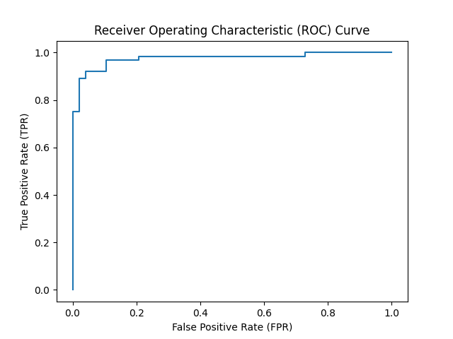
  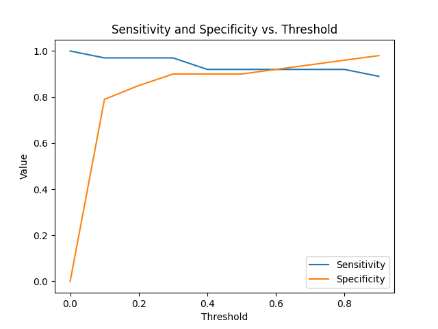
</div>

<br>
<br>


## Experiment 2 - Details

|    Name    | BATCH_SIZE | NUM_EPOCHS |    LR    |   MODEL_PTH    |   AURoc    |  Accuracy  |  F1_Score   |
|:----------:|:----------:|:----------:|:-------:|:--------------:|:----------:|:----------:|:-----------:|
| ResNet101  |     16     |     30     |  0.001  | resnet101.pth  | 0.991901517| 0.946428597| 0.9523809552|

<br>

<div style="display: flex; gap: 20px;">
  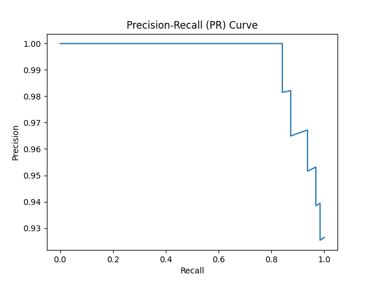
  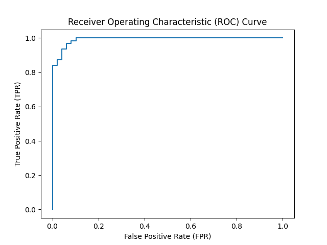
  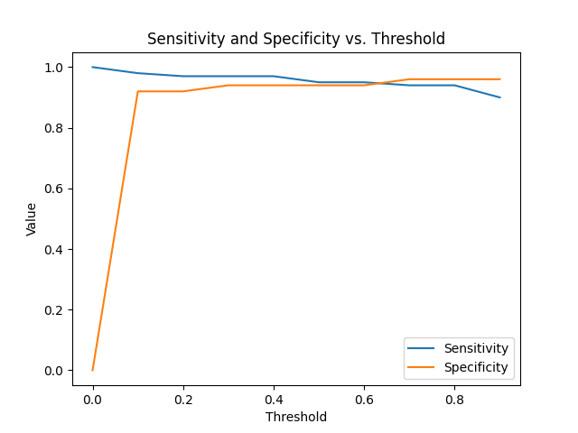
</div>

<br>
<br>

## Experiment 3 - Details

|   Name   | BATCH_SIZE | NUM_EPOCHS |   LR   |  MODEL_PTH   |   AURoc    |  Accuracy  |  F1_Score   |
|:--------:|:----------:|:----------:|:------:|:------------:|:----------:|:----------:|:-----------:|
| ResNext  |     16     |     30     | 0.001  | resnext.pth  | 0.979817689| 0.928571403| 0.935483873 |

<br>

<div style="display: flex; gap: 20px;">
  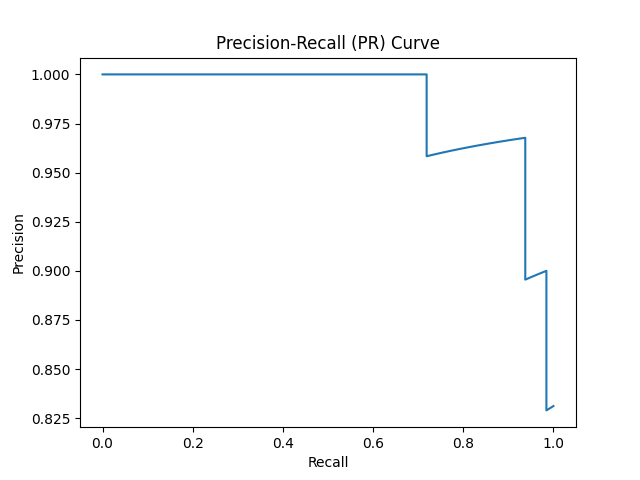
  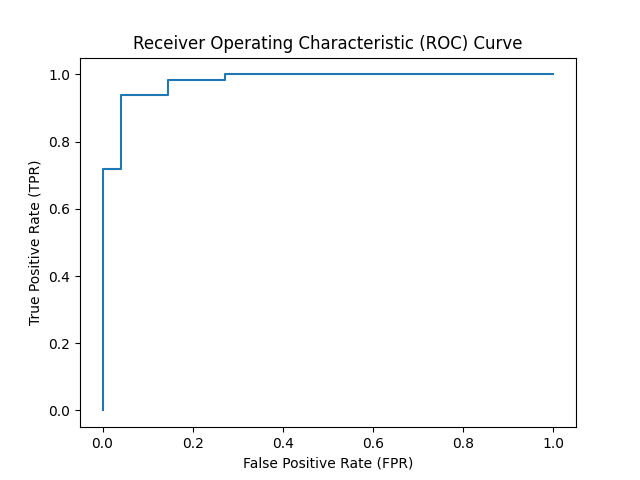
  
</div>


<br>
<br>


Visualisation
=============
[Demo Link](https://huggingface.co/spaces/rohitkuk/water_logging_project_)


